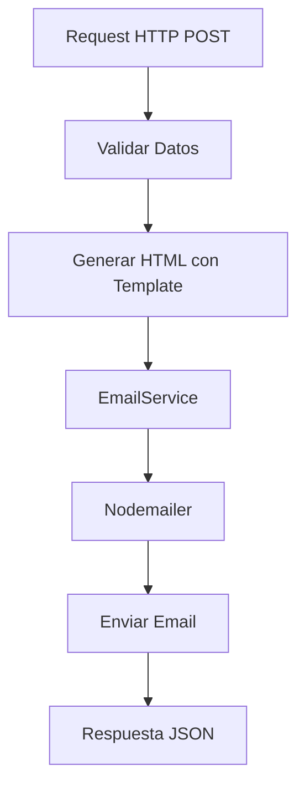

# Sistema de Notificaciones por Email

Este proyecto es una base genérica para crear sistemas de notificaciones por email usando Vercel Serverless Functions, TypeScript y Nodemailer. Proporciona una estructura modular y reutilizable para enviar emails HTML con templates personalizables.

## 📋 Tabla de Contenidos

- [Estructura del Proyecto](#estructura-del-proyecto)
- [Configuración](#configuración)
- [Cómo Funciona](#cómo-funciona)
- [Crear un Nuevo Endpoint Webhook](#crear-un-nuevo-endpoint-webhook)
- [Ejemplos de Uso](#ejemplos-de-uso)
- [Templates Personalizados](#templates-personalizados)

## 🏗️ Estructura del Proyecto

```
notificaciones-ClerviceRevolutions/
├── api/                    # Endpoints de Vercel (webhooks)
│   └── hello.ts           # Ejemplo de webhook
├── src/                    # Código fuente principal
│   ├── EmailService.ts    # Servicio de envío de emails
│   └── Supabase.ts        # Cliente de Supabase (opcional)
├── templates/             # Plantillas HTML para emails
│   ├── Ejemplo.ts         # Template genérico de ejemplo
│   └── index.ts           # Exports de templates
├── types/                 # Definiciones de tipos TypeScript
│   ├── email.ts           # Tipos relacionados con emails
│   ├── supabase.ts        # Tipos de Supabase
│   └── index.ts           # Exports de tipos
└── docs/                  # Documentación
    └── README.md          # Este archivo
```

## ⚙️ Configuración

### Variables de Entorno

Crea un archivo `.env` o configura las siguientes variables de entorno en Vercel:

```env
# Configuración de Email (Gmail)
Email=tu-email@gmail.com
Password=tu-contraseña-de-aplicacion

# URL de la aplicación web (opcional)
URL_WEB=https://tu-app.com

# Supabase (opcional, si usas Supabase)
SUPABASE_URL=https://tu-proyecto.supabase.co
SUPABASE_SERVICE_ROLE_KEY=tu-service-role-key
```

### Configuración de Gmail

Para usar Gmail, necesitas crear una **Contraseña de aplicación**:

1. Ve a tu cuenta de Google: https://myaccount.google.com/
2. Activa la verificación en 2 pasos
3. Ve a "Contraseñas de aplicaciones"
4. Genera una nueva contraseña para "Correo"
5. Usa esa contraseña en la variable `Password`

### Instalación de Dependencias

```bash
npm install
```

## 🔄 Cómo Funciona

### Flujo de una Notificación



### Componentes Principales

#### 1. **EmailService** (`src/EmailService.ts`)

Servicio centralizado para enviar emails. Proporciona:

- `sendEmail()`: Envía un email con opciones personalizadas
- `sendNotification()`: Método simplificado para notificaciones básicas
- `sendTemplateEmail()`: Envía emails con templates y variables

#### 2. **Templates** (`templates/`)

Plantillas HTML que generan el contenido del email. Están optimizadas para:

- Compatibilidad con Outlook
- Diseño responsive
- Estructura basada en tablas HTML

#### 3. **Endpoints** (`api/`)

Funciones serverless de Vercel que actúan como webhooks. Cada archivo en `api/` se convierte automáticamente en un endpoint.

## 🚀 Crear un Nuevo Endpoint Webhook

### Paso 1: Crear el Archivo del Endpoint

Crea un nuevo archivo en la carpeta `api/`, por ejemplo `api/mi-notificacion.ts`:

```typescript
import type { VercelRequest, VercelResponse } from "@vercel/node"
import { emailService } from "../src/EmailService"
import { TemplateEjemplo, EjemploData } from "../templates/Ejemplo"

export default async (req: VercelRequest, res: VercelResponse) => {
    try {
        // 1. Validar método HTTP
        if (req.method !== "POST") {
            return res.status(405).json({
                success: false,
                error: "Método no permitido. Use POST.",
            })
        }

        // 2. Obtener y validar datos del body
        const body = req.body

        if (!body.destinatarios || !Array.isArray(body.destinatarios)) {
            return res.status(400).json({
                success: false,
                error: "El campo 'destinatarios' es requerido",
            })
        }

        // 3. Preparar datos para el template
        const datosEjemplo: EjemploData = {
            titulo: body.titulo || "Notificación",
            mensaje: body.mensaje || "Tienes una nueva notificación",
            tipo: body.tipo || "info",
            datosAdicionales: body.datosAdicionales || [],
            urlAccion: body.urlAccion,
            textoAccion: body.textoAccion,
        }

        // 4. Generar HTML con el template
        const urlWeb = process.env.URL_WEB
        const emailHtml = TemplateEjemplo(datosEjemplo, urlWeb)

        // 5. Enviar el email
        const emailResult = await emailService.sendEmail({
            to: body.destinatarios,
            subject: datosEjemplo.titulo,
            html: emailHtml,
        })

        // 6. Manejar respuesta
        if (!emailResult.success) {
            return res.status(500).json({
                success: false,
                error: emailResult.error,
            })
        }

        return res.status(200).json({
            success: true,
            data: {
                messageId: emailResult.messageId,
                destinatarios: body.destinatarios,
            },
        })
    } catch (error) {
        console.error("Error:", error)
        return res.status(500).json({
            success: false,
            error: error instanceof Error ? error.message : "Error desconocido",
        })
    }
}
```

### Paso 2: Desplegar en Vercel

El endpoint estará disponible automáticamente en:
```
https://tu-proyecto.vercel.app/api/mi-notificacion
```

### Paso 3: Probar el Endpoint

Puedes probar el endpoint con `curl` o cualquier cliente HTTP:

```bash
curl -X POST https://tu-proyecto.vercel.app/api/mi-notificacion \
  -H "Content-Type: application/json" \
  -d '{
    "destinatarios": ["usuario@ejemplo.com"],
    "titulo": "Notificación de Prueba",
    "mensaje": "Este es un mensaje de prueba",
    "tipo": "success"
  }'
```

## 📝 Ejemplos de Uso

### Ejemplo 1: Notificación Simple

```json
POST /api/hello
{
  "destinatarios": ["usuario@ejemplo.com"],
  "titulo": "Bienvenido",
  "mensaje": "Gracias por registrarte en nuestro sistema"
}
```

### Ejemplo 2: Notificación con Datos Adicionales

```json
POST /api/hello
{
  "destinatarios": ["usuario@ejemplo.com"],
  "titulo": "Pedido Confirmado",
  "mensaje": "Tu pedido ha sido confirmado exitosamente",
  "tipo": "success",
  "datosAdicionales": [
    {
      "etiqueta": "Número de Pedido",
      "valor": "PED-12345"
    },
    {
      "etiqueta": "Fecha",
      "valor": "2024-01-15"
    },
    {
      "etiqueta": "Total",
      "valor": "$1,500.00"
    }
  ]
}
```

### Ejemplo 3: Notificación con Botón de Acción

```json
POST /api/hello
{
  "destinatarios": ["usuario@ejemplo.com"],
  "titulo": "Revisión Requerida",
  "mensaje": "Tienes un documento pendiente de revisión",
  "tipo": "warning",
  "urlAccion": "https://tu-app.com/revisiones/123",
  "textoAccion": "Revisar Documento"
}
```

### Ejemplo 4: Notificación de Error

```json
POST /api/hello
{
  "destinatarios": ["admin@ejemplo.com"],
  "titulo": "Error en el Sistema",
  "mensaje": "Se ha detectado un error crítico que requiere atención",
  "tipo": "error",
  "datosAdicionales": [
    {
      "etiqueta": "Código de Error",
      "valor": "ERR-500"
    },
    {
      "etiqueta": "Timestamp",
      "valor": "2024-01-15 10:30:00"
    }
  ]
}
```

## 🎨 Templates Personalizados

### Crear un Template Personalizado

1. Crea un nuevo archivo en `templates/`, por ejemplo `templates/MiTemplate.ts`:

```typescript
export interface MiTemplateData {
    nombre: string
    mensaje: string
    // ... otros campos
}

const MiTemplate = (data: MiTemplateData) => {
    return `<!DOCTYPE html>
<html>
<head>
    <meta charset="UTF-8">
    <title>${data.nombre}</title>
</head>
<body>
    <h1>${data.nombre}</h1>
    <p>${data.mensaje}</p>
</body>
</html>`
}

export { MiTemplate }
```

2. Exporta el template en `templates/index.ts`:

```typescript
export * from './Ejemplo'
export * from './MiTemplate'
```

3. Usa el template en tu endpoint:

```typescript
import { MiTemplate } from "../templates/MiTemplate"

const emailHtml = MiTemplate({
    nombre: "Juan",
    mensaje: "Hola desde mi template personalizado"
})
```

### Tipos de Notificación Disponibles

El template `TemplateEjemplo` soporta los siguientes tipos:

- **`info`**: Información general (azul)
- **`success`**: Operación exitosa (verde)
- **`warning`**: Advertencia (amarillo/naranja)
- **`error`**: Error crítico (rojo)

## 📚 Estructura de Datos

### EjemploData Interface

```typescript
interface EjemploData {
    titulo: string                    // Título de la notificación (requerido)
    mensaje: string                   // Mensaje principal (requerido)
    tipo?: 'info' | 'success' | 'warning' | 'error'  // Tipo de notificación (opcional)
    datosAdicionales?: Array<{        // Datos adicionales a mostrar (opcional)
        etiqueta: string
        valor: string
    }>
    urlAccion?: string                // URL para botón de acción (opcional)
    textoAccion?: string              // Texto del botón (opcional)
}
```

## 🔒 Seguridad

### Recomendaciones

1. **Validación de Datos**: Siempre valida los datos recibidos en el body
2. **Autenticación**: Considera agregar autenticación (API keys, JWT, etc.)
3. **Rate Limiting**: Implementa límites de tasa para prevenir abuso
4. **Sanitización**: Sanitiza los datos antes de insertarlos en HTML
5. **Variables de Entorno**: Nunca expongas credenciales en el código

### Ejemplo con Autenticación

```typescript
export default async (req: VercelRequest, res: VercelResponse) => {
    // Validar API key
    const apiKey = req.headers['x-api-key']
    if (apiKey !== process.env.API_KEY) {
        return res.status(401).json({
            success: false,
            error: "No autorizado"
        })
    }
    
    // ... resto del código
}
```

## 🐛 Solución de Problemas

### Error: "Las variables de entorno Email y Password son requeridas"

**Solución**: Asegúrate de configurar las variables de entorno en Vercel o en tu archivo `.env` local.

### Error: "Error al enviar el email"

**Posibles causas**:
- Credenciales incorrectas
- Contraseña de aplicación no configurada correctamente
- Problemas de red o firewall

**Solución**: Verifica las credenciales y la configuración de Gmail.

### Emails no se reciben

**Verifica**:
- Que el email esté en la lista de destinatarios
- Que no estén en spam
- Los logs de Vercel para ver errores específicos

## 📖 Recursos Adicionales

- [Documentación de Vercel Serverless Functions](https://vercel.com/docs/functions)
- [Documentación de Nodemailer](https://nodemailer.com/about/)
- [Guía de HTML para Emails](https://www.campaignmonitor.com/dev-resources/guides/coding/)

## 📄 Licencia

Este proyecto es una base genérica y puede ser usado libremente en otros proyectos.
